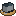
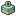
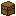

# Teleport
Teleport is a Minecraft data pack that adds tools to help you move quickly.

Use command `/function teleport:item` to get all tools.

Hold in hand and right click to use.

##  Forward teleport

Teleport you to the block that you are looking at.

Stop if [max forward teleport distance](#-teleport-settings) is reached.

##  Backward teleport

Teleport you along the opposite direction of where you are looking.

Stop if blocked, or [max backward teleport distance](#-teleport-settings) is reached.

##  To the back of the wall

Teleport you to the other side of the wall that you are looking at.

Before entering the wall, stop if [max forward teleport distance](#-teleport-settings) is reached.

##  To the top of the wall

Teleport you to the top of the wall that you are looking at.

Before entering the wall, stop if [max forward teleport distance](#-teleport-settings) is reached.

##  To the world surface

Teleport you to the world surface (the top of the highest block) where you are.

The same as `execute positioned over world_surface`.

##  Random Teleport

Teleport you Randomly.

Your x and z coordinates will change by a random value whose absolute value is between [min and max random teleport offsets](#-teleport-settings), while your y coordinate remains unchanged.

##  To the Nether

Teleport you to the Nether.

##  To the End

Teleport you to the obsidian platform (to 100, 49, 0) in the End.

##  To the world spawn point

Teleport you to the world spawn point.

The world spawn point is cached. Each time the world spawn point is modified (e.g., via the `/setworldspawn` command), please use the `/reload` command or [go there](#-teleport-settings) to update the cache.

##  To my spawn point

Teleport you to your spawn point.

If you don't have a spawn point, teleport you to the world spawn point.

##  Back to death location

Teleport you to your last death location.

##  Undo

Teleport you to where you last used other teleport tools.

##  Teleport history

Show the teleport history.

Each time when you use teleport tools, before teleporting, your position will be added to the teleport history.

Newly added record appears at the buttom, and has a smaller index.

Click  to clear teleport history.

For each record:

- Click  to teleport you to the recorded location and delete it and all subsequent records.
- Click  to delete it.

If you don't want it to record teleport history, click  to pause. Click  to restart. You can also change it in [settings](#-teleport-settings).

##  Add a point

It's a writable book. Write some words and click 'Done', and a teleport point will be added.

Where you are will be the location of the point, What you write will be the name of the point.

##  Teleport points

Show all teleport points you added.

Newly added point appears at the buttom, and has a smaller index.

Click  to delete all points.

For each point:

- Click  to teleport you to it.
- Click  to move it to the bottom.
- Click  to delete it.

##  All teleport tools

It's a written book. You can use all teleport tools in it.

##  Fly

Right click to ride a cloud. 

- Press keys to start continuously moving.

| Key          | Direction |
| ------------ | --------- |
| W            | Forward   |
| A            | Left      |
| S            | Backward  |
| D            | Right     |
| Space        | Up        |
| Left Control | Down      |

- Right click to stop.

Press Left Shift to dismount.

You can change [flying speed](#-teleport-settings).

##  Teleport settings

| Settings                                                                                    | Default       |
| ------------------------------------------------------------------------------------------- | ------------- |
|  Max forward teleport distance   | 32 blocks     |
|  Max backward teleport distance | 32 blocks     |
|  Flying speed                        | 16 blocks / s |
|  Min random teleport offset       | 1024 blocks   |
|  Max random teleport offset       | 2048 blocks   |
|  Record teleport history         | true          |
|  Actionbar messages          | true          |
|  Sounds                        | true          |

If it's a number, click it and input a new number and press enter to change it.

Click  to refresh the page to see your changes.

If it's true or false, click it to change it.

| Options                                                                                            |
| -------------------------------------------------------------------------------------------------- |
|  Update the world spawn point cache |
|  Reset all settings to default         |
|  Refresh the page                    |